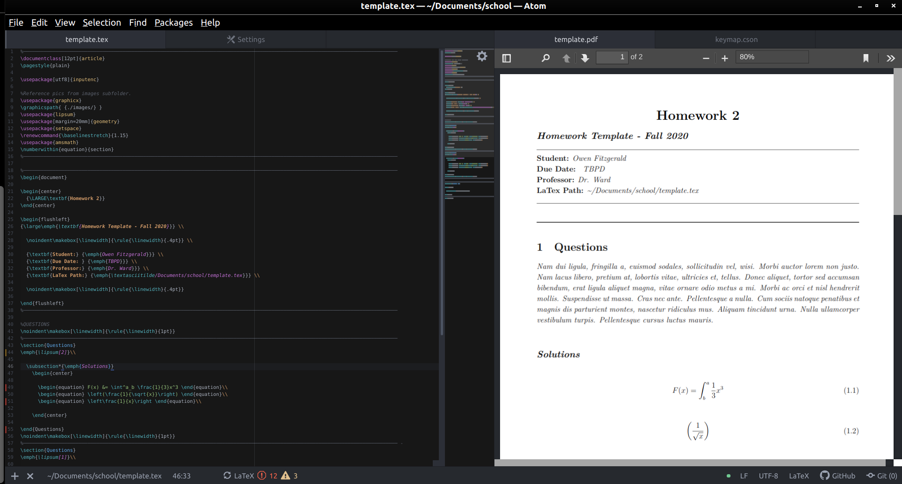

# Fall-2020
Going to try to store all my work for the semester here. \
Spent some time writing a LaTex template from scratch. \
***Advanced Lab*** \
***Optics*** 

# Cool stuff
Installed miktex and the atom latex package to compile LaTeX in a good text editor/IDE. \
Using sage shell as an alternative to Wolfram Alpha. 

# Workflow

